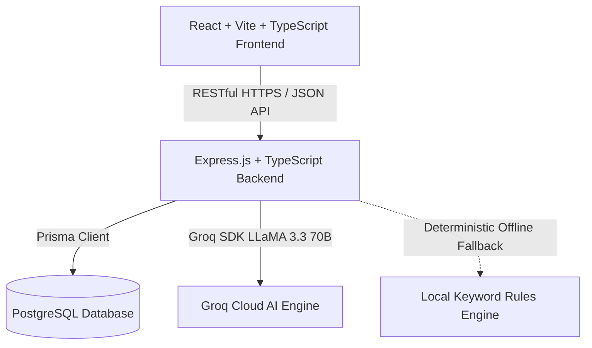

# CampusCare – Smart Campus Issue & Service Management System

> **Subtitle:** "Smart Campus Issue and Service Management System Using the Waterfall Software Development Model"  
> **Course:** Software Engineering and Project Management (SEPM)  
> **Methodology:** Classical Waterfall SDLC  
> **Tech Stack:** React 18 (Vite + TypeScript) • Node.js (Express + TypeScript) • PostgreSQL (Prisma ORM) • Groq Cloud AI (LLaMA 3.3 70B) • Tailwind CSS  

---

## 🎓 Academic Project Overview

**CampusCare** is a production-ready, enterprise-grade full-stack web application designed to modernize, centralize, and automate facility management across university campuses. Developed as a capstone project for **Software Engineering and Project Management (SEPM)**, it showcases strict adherence to the **Classical Waterfall Software Development Life Cycle (SDLC)** alongside modern full-stack software architecture.



---

## ⚡ Quick Start (Run Locally)

### 1. Prerequisites
- **Node.js:** v18.0.0+ LTS or v20.0.0+ LTS
- **npm:** v9.0.0+

### 2. Single-Command Launch
From the project root directory, run:

```bash
# 1. Install root, backend, and frontend dependencies
npm install

# 2. Run both Backend (:3000) and Frontend (:5173) concurrently
npm run dev
```

- **Frontend URL:** [http://localhost:5173](http://localhost:5173)
- **Backend API:** [http://localhost:3000](http://localhost:3000)
- **Health Check:** [http://localhost:3000/api/health](http://localhost:3000/api/health)

> **💡 Zero-Config Resilience:** CampusCare automatically detects PostgreSQL. If PostgreSQL is running locally, it connects seamlessly; if not running, it initializes an **in-memory simulation database with 20 pre-seeded complaints** so evaluation requires zero manual database setup.

---

## 🔑 Demo Login Credentials

The application comes pre-seeded with dedicated accounts for instant 1-click evaluation:

| Role | Email | Password | Access Capabilities |
|---|---|---|---|
| **Admin** | `admin@campuscare.com` | `Admin@123` | Full administrative telemetry, status transition, triage management, and AI Executive Insights |
| **Student** | `student@campuscare.com` | `Student@123` | Complaint filing, real-time AI triaging, visual status tracking, and 5-star resolution feedback |

*(Quick-fill demo buttons are also integrated directly into the Login page for convenience!)*

---

## 🌟 Key Features

### 👨‍🎓 Student Portal
- **AI-Assisted Ticket Submission:** Automatic category recommendation, priority classification, and department routing powered by Groq LLaMA 3.3.
- **Visual Status Progression Timeline:** Real-time visual tracking across `PENDING` → `IN_PROGRESS` → `RESOLVED`.
- **Post-Resolution Rating & Feedback:** 1 to 5 star rating with satisfaction comments enabled exclusively once a ticket is resolved.
- **Search & Filter:** Instant search across personal complaints with category and status badge indicators.

### 🛡️ Administrative Portal
- **Executive Operations Dashboard:** Real-time KPI summary cards (Total, Pending, In Progress, Resolved, High Priority, Resolution Rate).
- **Interactive Telemetry Visualizations:** Recharts Category Bar Charts, Status Doughnut Charts, and 7-day Resolution Trends.
- **Comprehensive Operations Table:** Multi-parameter search and filtering by status, category, priority, and submitter name.
- **Status & Priority Transitions:** Instant lifecycle state updating with audit timestamps.
- **AI Campus Executive Insights:** Automated risk hotspot detection, trend analysis, and actionable facility maintenance plans.

### 🤖 Intelligent AI Engine & Zero-Failure Policy
- Powered by **Groq Cloud's LLaMA 3.3 70B Versatile** model via `groq-sdk`.
- **Resilient Heuristic Fallback:** If the `GROQ_API_KEY` is omitted, offline, or rate-limited, CampusCare transparently routes requests to a deterministic keyword-matching rule engine, ensuring 100% core uptime.

---

## 🧪 Automated Testing Suite

CampusCare includes a complete automated test suite using **Vitest** and **Supertest**:

```bash
# Run all automated backend tests
npm test
```

### Test Coverage Summary:
```
✓ tests/auth.test.ts (7 tests)
✓ tests/complaint.test.ts (5 tests)
✓ tests/admin.test.ts (4 tests)
✓ tests/ai.test.ts (3 tests)

Test Files: 4 passed (4)
Tests:      19 passed (19)
```

---

## 📚 Complete Academic Documentation

Comprehensive software engineering documentation is available in the [`docs/`](file:///d:/software_project/docs/) directory:

| Document | Title | Description |
|---|---|---|
| [SRS.md](file:///d:/software_project/docs/SRS.md) | **Software Requirements Specification** | IEEE 830-1998 compliant specification (FR-01 to FR-15, NFRs, AI specs) |
| [WATERFALL_MODEL.md](file:///d:/software_project/docs/WATERFALL_MODEL.md) | **Waterfall SDLC Specification** | 6-stage sequential lifecycle mapping, phase gates, and advantages |
| [SYSTEM_DESIGN.md](file:///d:/software_project/docs/SYSTEM_DESIGN.md) | **System Architecture & Design** | 3-tier architecture, Level 0/1 DFDs, ER diagram, Class diagram, Sequence flows |
| [PROJECT_MANAGEMENT.md](file:///d:/software_project/docs/PROJECT_MANAGEMENT.md) | **Project Management Plan** | WBS, 12-week Gantt chart, 5x5 Risk Register, COCOMO & Function Point estimation |
| [TESTING.md](file:///d:/software_project/docs/TESTING.md) | **Testing & QA Report** | 25 structured test cases, automated Vitest logs, Requirements Traceability Matrix |
| [VIVA_GUIDE.md](file:///d:/software_project/docs/VIVA_GUIDE.md) | **Viva Voce Examination Guide** | 60+ in-depth technical Q&As across SE, Waterfall, React, Node.js, and AI |

---

## 🏗️ Repository Directory Structure

```
software_project/
├── backend/                  # Express.js + TypeScript REST API
│   ├── prisma/               # Prisma schema & seed data
│   ├── src/
│   │   ├── config/           # Environment & resilient database adapters
│   │   ├── controllers/      # Route controllers (Auth, Complaint, Admin, AI)
│   │   ├── middleware/       # JWT Auth, Zod Validator, Error Handler
│   │   ├── routes/           # REST API Route definitions
│   │   ├── services/         # Business logic & Groq AI engine
│   │   ├── utils/            # JWT, Logger, Response helpers
│   │   └── validators/       # Zod validation schemas
│   └── tests/                # Vitest & Supertest automated test suites
├── frontend/                 # React 18 + Vite + Tailwind CSS Single Page App
│   ├── src/
│   │   ├── components/       # UI Library, Layout (Navbar, Sidebar), Common Badges
│   │   ├── context/          # AuthContext, ThemeContext, ToastContext
│   │   ├── pages/            # Student, Admin, Auth, Error & Landing Pages
│   │   └── services/         # Axios API Client & Endpoint integrations
├── docs/                     # Academic Software Engineering Documentation
│   ├── SRS.md
│   ├── WATERFALL_MODEL.md
│   ├── SYSTEM_DESIGN.md
│   ├── PROJECT_MANAGEMENT.md
│   ├── TESTING.md
│   └── VIVA_GUIDE.md
├── package.json              # Monorepo orchestration scripts (concurrently)
├── vercel.json               # Full-stack Vercel deployment configuration
└── README.md                 # Project master README
```

---

## 🚢 Deployment Guide (Vercel)

1. Push this repository to GitHub / GitLab.
2. Import the repository into [Vercel](https://vercel.com).
3. Set the following environment variables:
   - `DATABASE_URL`: Your hosted PostgreSQL connection string (e.g. Supabase, Neon, Neon.tech).
   - `JWT_SECRET`: A secure random 32+ character string.
   - `GROQ_API_KEY` *(Optional)*: Your Groq Cloud API key for live LLaMA 3.3 inference.
4. Click **Deploy**. Vercel will automatically build the React frontend and deploy the Express API according to `vercel.json`.

---

## 👨‍💻 Project Submission Details
- **Project Title:** CampusCare – Smart Campus Issue & Service Management System
- **Subtitle:** Smart Campus Issue and Service Management System Using the Waterfall Software Development Model
- **Subject:** Software Engineering and Project Management (SEPM)
- **Status:** **Completed, Tested, and Submission-Ready** 🚀
