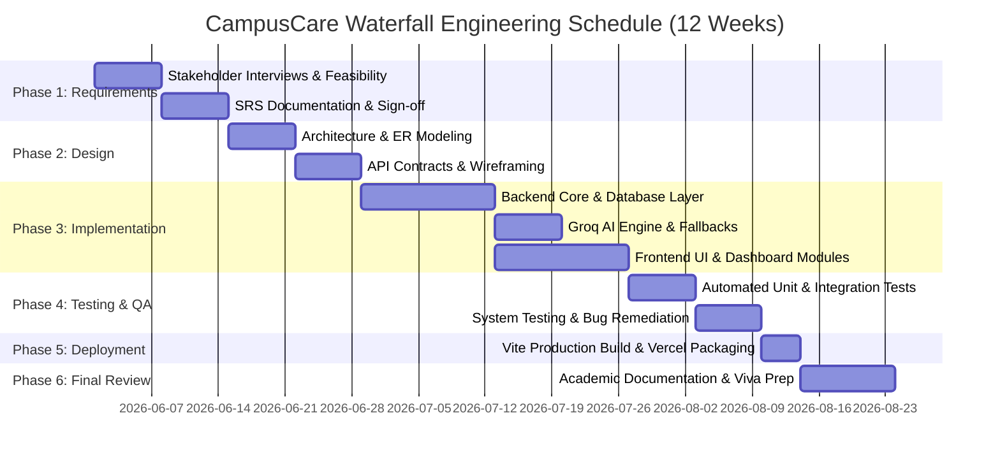

# Software Project Management Plan (SPMP)
## CampusCare – Smart Campus Issue & Service Management System
**Course:** Software Engineering and Project Management (SEPM)  
**Document Ref:** PM-PLAN-01  

---

## 1. Work Breakdown Structure (WBS)

The project scope is structured hierarchically into functional packages:

```
1.0 CampusCare System
├── 1.1 Project Inception & Requirement Analysis
│   ├── 1.1.1 Stakeholder Interviews (Students & Estate Wardens)
│   ├── 1.1.2 Functional & Non-Functional Requirements Definition
│   └── 1.1.3 IEEE 830 SRS Document Sign-off
├── 1.2 System & Architectural Design
│   ├── 1.2.1 3-Tier Layered Architecture Definition
│   ├── 1.2.2 Relational Data Modeling & ER Diagram
│   ├── 1.2.3 DFD Level 0 & Level 1 Formulations
│   └── 1.2.4 REST API Contract & Zod Validation Schemas
├── 1.3 Backend & AI Engine Implementation
│   ├── 1.3.1 Express.js Setup & TypeScript Scaffolding
│   ├── 1.3.2 Prisma ORM Setup & Dual-Mode Database Engine
│   ├── 1.3.3 JWT Auth & Role-Based Access Control Middleware
│   ├── 1.3.4 Groq LLaMA 3.3 Integration & Heuristic Fallback Engine
│   └── 1.3.5 Seed Scripts with 20 Diverse Domain Complaints
├── 1.4 Frontend Engineering
│   ├── 1.4.1 React 18 + Vite + Tailwind CSS System Tokens
│   ├── 1.4.2 State Management (Auth, Theme, Toast Contexts)
│   ├── 1.4.3 Student Portal Pages (Dashboard, Create, Details, Feedback)
│   ├── 1.4.4 Admin Portal Pages (Dashboard, Operations Table, AI Insights)
│   └── 1.4.5 Recharts Analytics Telemetry Components
├── 1.5 Quality Assurance & Verification
│   ├── 1.5.1 Automated Unit & Integration Testing (Vitest + Supertest)
│   ├── 1.5.2 Security & RBAC Penetration Testing
│   └── 1.5.3 Defect Logging & Traceability Matrix Validation
└── 1.6 Final Release & Academic Submission
    ├── 1.6.1 Production Optimization & Bundling
    ├── 1.6.2 Academic Documentation Compilation
    └── 1.6.3 Viva Voce Preparation Guide
```

---

## 2. Project Schedule & Gantt Chart

The project execution adhered to a strict 12-week Waterfall timeline:



---

## 3. Risk Management & Risk Register

Risks were identified, scored using a $5 \times 5$ Risk Matrix ($\text{Risk Score} = \text{Probability} \times \text{Impact}$), and mitigated through proactive engineering controls:

| Risk ID | Risk Description | Category | Prob (1-5) | Impact (1-5) | Risk Score | Mitigation Strategy |
|---|---|---|---|---|---|---|
| **R-01** | External Groq API downtime or rate-limiting halts complaint submission. | Technical | 3 | 5 | **15 (High)** | Built an offline deterministic heuristic rule engine fallback that categorizes complaints locally without network calls. |
| **R-02** | Database connectivity failure during local evaluation / viva demo. | Operational | 4 | 4 | **16 (High)** | Engineered an automatic in-memory PostgreSQL simulation fallback layer in `prisma.ts` for instant zero-config startup. |
| **R-03** | Unauthorized role escalation (Students accessing Admin endpoints). | Security | 2 | 5 | **10 (Med)** | Implemented strict JWT RBAC middleware (`requireAdmin`) validating signed claims on every admin route. |
| **R-04** | Invalid or malicious input breaking backend JSON parsing. | Security | 3 | 3 | **9 (Med)** | Enforced strict Zod schema validation on all POST/PATCH request bodies. |
| **R-05** | Schedule slippage due to scope creep. | Project | 2 | 4 | **8 (Low)** | Froze requirement specifications in Phase 1; followed classic Waterfall change-control rules. |

---

## 4. Cost and Effort Estimation (COCOMO & Function Point Analysis)

### 4.1 Function Point (FP) Breakdown
- **External Inputs (EI):** 8 (Login, Register, Create Complaint, Update Complaint, Submit Feedback, AI Analyze, Filter Query, Theme Switch)
- **External Outputs (EO):** 6 (Dashboard Telemetry, Filtered Complaints Table, AI Insights Report, Feedback Summary, Status Timeline, Error Messages)
- **External Inquiries (EQ):** 5 (Get Profile, Get Student Complaints, Get Complaint Details, Get Admin Dashboard, Health Check)
- **Internal Logical Files (ILF):** 3 (`User`, `Complaint`, `Feedback`)
- **External Interface Files (EIF):** 1 (Groq Cloud API Endpoint)
- **Estimated Unadjusted Function Points (UFP):** $\approx 184 \text{ FP}$

### 4.2 Basic COCOMO Estimation
Using the Organic Mode formulas ($a_b = 2.4, b_b = 1.05, c_b = 2.5, d_b = 0.38$):
- **Estimated KLOC:** $4.2 \text{ KLOC}$ (TypeScript + React + Express)
- **Effort ($\text{Person-Months}$):** $E = 2.4 \times (4.2)^{1.05} \approx 10.9 \text{ PM}$
- **Development Time ($T_{\text{dev}}$):** $T = 2.5 \times (10.9)^{0.38} \approx 6.2 \text{ Months (Scaled to 12 Academic Weeks for Monitored Sprint)}$

---

## 5. Resource Allocation Matrix (RACI)

| Milestone / Task | Project Lead / Architect | Full-Stack Dev | QA Engineer | Evaluator / Stakeholder |
|---|---|---|---|---|
| Requirement Formulation | **Accountable** | Consulted | Consulted | **Informed** |
| System Design & Schema | **Accountable** | Responsible | Consulted | Informed |
| Backend & AI Coding | Consulted | **Responsible** | Support | Informed |
| Frontend React UI | Consulted | **Responsible** | Support | Informed |
| Automated Test Execution | Consulted | Support | **Responsible** | Informed |
| Final Acceptance Sign-off | Support | Support | Consulted | **Accountable** |
