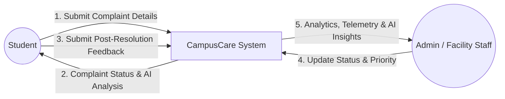
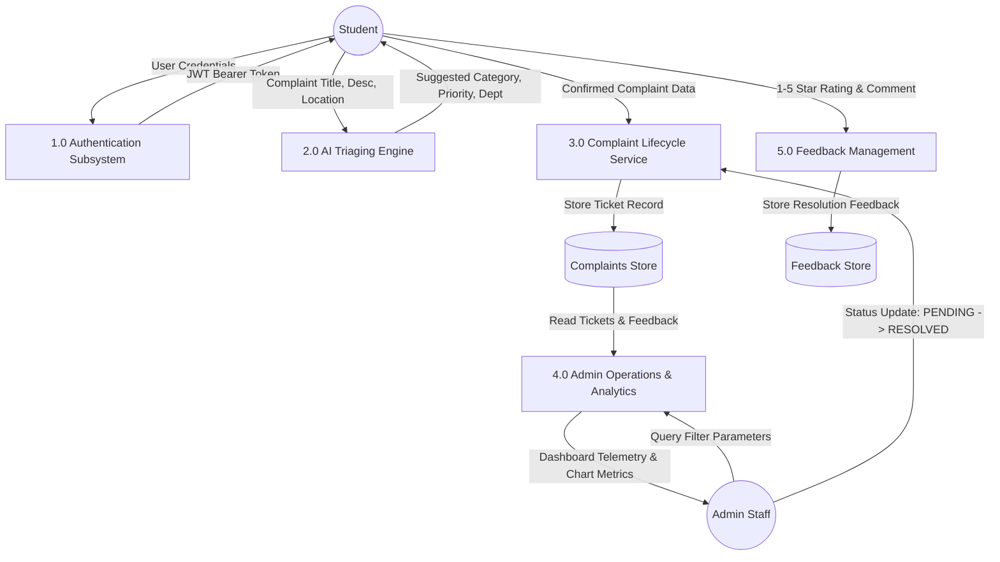
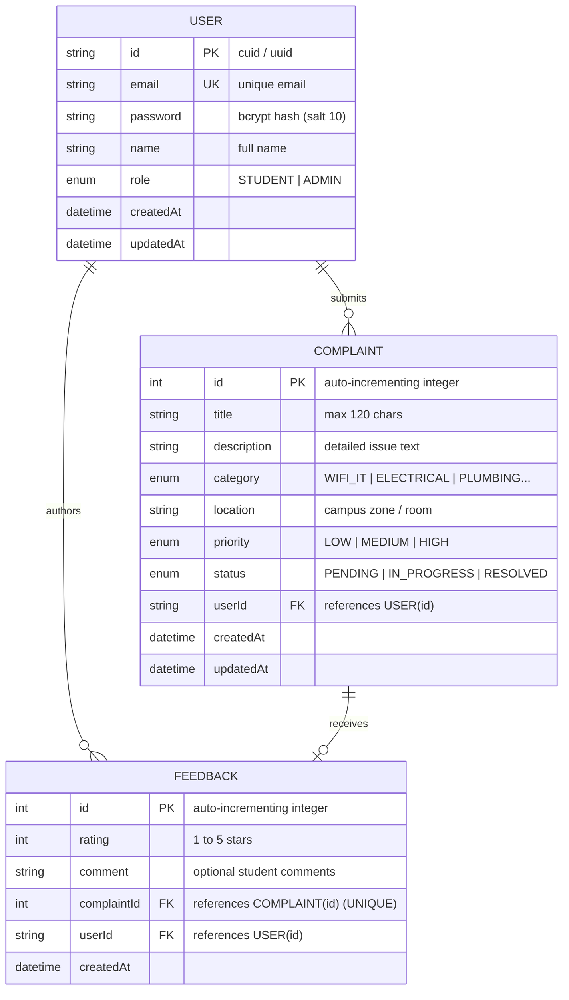
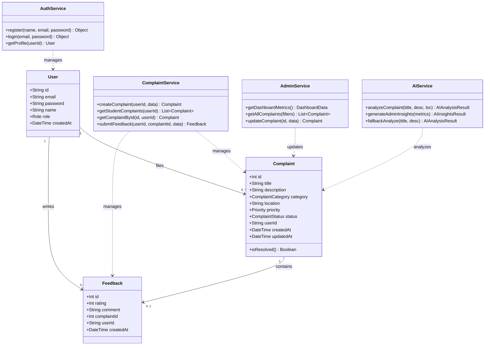
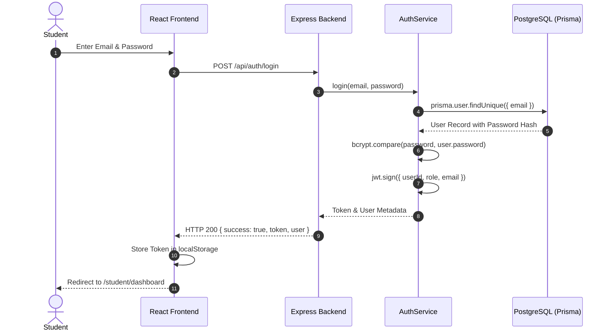
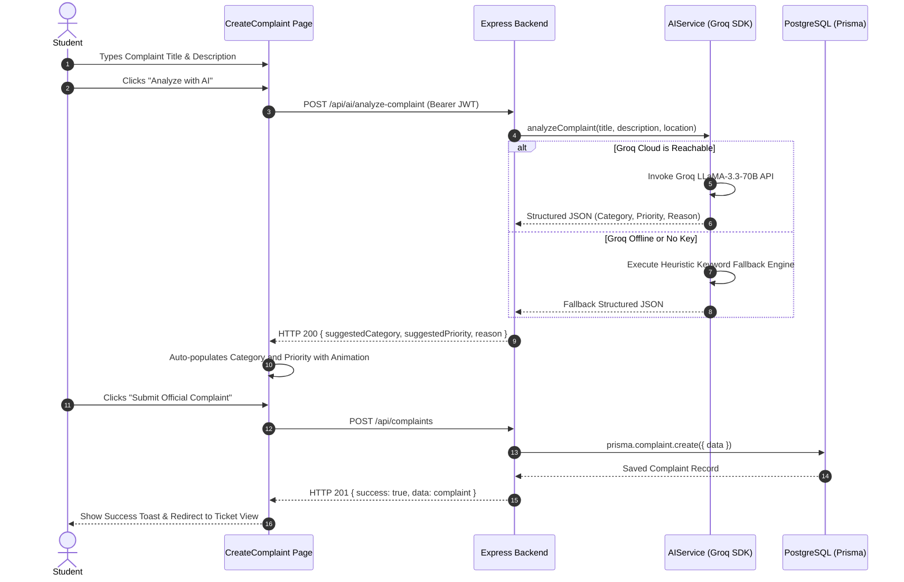
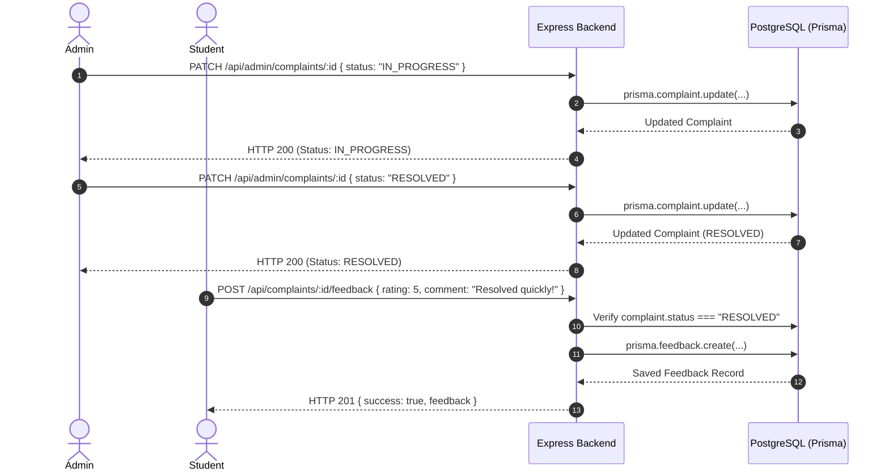

# System Architecture & Technical Design Specification
## CampusCare – Smart Campus Issue & Service Management System
**Course:** Software Engineering and Project Management (SEPM)  
**Document Ref:** ARCH-DES-01  

---

## 1. System Architecture (Three-Tier Enterprise Model)

CampusCare is architected around a strict separation of concerns into three decoupled tiers:

```mermaid
graph TD
    subgraph Presentation Tier (Client)
        UI[React 18 + TypeScript SPA]
        Tailwind[Tailwind CSS Design System]
        Recharts[Recharts Analytics Dashboards]
        Framer[Framer Motion Animations]
    end

    subgraph Application Tier (API Server)
        Router[Express.js Router & Middleware]
        AuthGuard[JWT Auth & RBAC Guard]
        Validator[Zod Schema Validator]
        Services[Business Logic Services]
        AIService[Groq LLaMA 3.3 Engine + Heuristic Fallback]
    end

    subgraph Data Tier (Persistence & Cloud)
        Prisma[Prisma ORM Client]
        DB[(PostgreSQL Relational Database)]
        GroqCloud[Groq Cloud AI API]
    end

    UI -->|HTTPS / JSON REST API| Router
    Router --> AuthGuard
    AuthGuard --> Validator
    Validator --> Services
    Services --> AIService
    Services --> Prisma
    Prisma --> DB
    AIService -->|Inference Query| GroqCloud
```

---

## 2. Data Flow Diagrams (DFD)

### 2.1 DFD Level 0 (Context Level Diagram)



### 2.2 DFD Level 1 (Decomposition Diagram)



---

## 3. Entity-Relationship (ER) Diagram



---

## 4. Class Diagram



---

## 5. Sequence Diagrams

### 5.1 User Authentication & JWT Generation


### 5.2 Complaint Creation with Groq AI Assistance


### 5.3 Administrative Status Transition & Student Feedback

