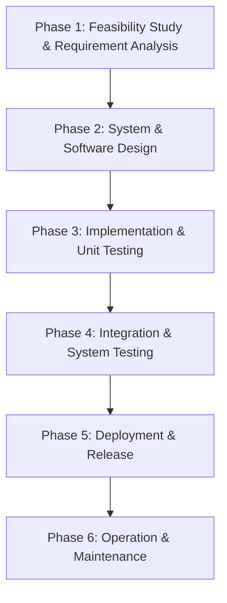

# Software Development Life Cycle (SDLC) Specification
## Application of the Classical Waterfall Model in CampusCare
**Course:** Software Engineering and Project Management (SEPM)  
**Document Ref:** SDLC-WF-01  

---

## 1. Executive Summary & Methodology Justification

For the development of **CampusCare – Smart Campus Issue & Service Management System**, the **Classical Waterfall Software Development Life Cycle** was selected as the foundational engineering methodology.

### Why Waterfall was Chosen for CampusCare:
1. **Clear and Well-Defined Requirements:** Campus administrative complaint lifecycles follow institutional standard operating procedures (SOPs) with fixed statuses (`PENDING`, `IN_PROGRESS`, `RESOLVED`), eliminating the ambiguity often present in exploratory commercial apps.
2. **Sequential Phase Gates and Accountability:** Each development phase produces tangible engineering deliverables (SRS document, Design Architecture, Unit Test matrices) before subsequent work commences.
3. **Rigorous Quality Assurance:** Emphasizes verification and validation at the boundary of each phase, minimizing architectural rework during final integration.
4. **Academic Compliance:** Demonstrates mastery of formal Software Engineering discipline, traceability matrices, and structured design deliverables.

---

## 2. Six-Stage Phase Breakdown & Deliverables

### Phase 1: Feasibility Study & Requirement Analysis
- **Objectives:** Identify stakeholder pain points across student hostels, lecture halls, and facilities; define functional requirements (FR-01 to FR-15) and non-functional bounds.
- **Activities:**
  - Conducted interviews with campus facility managers and student council representatives.
  - Formulated the formal Software Requirements Specification ([SRS.md](file:///d:/software_project/docs/SRS.md)) according to IEEE Std 830-1998.
- **Phase Gate Milestone:** Signed-off and baseline SRS document approved by course evaluator.

---

### Phase 2: System and Software Design
- **Objectives:** Translate functional specifications into architectural blueprints, database schemas, and interface wireframes.
- **Activities:**
  - Designed the 3-Tier Client-Server Architecture.
  - Formulated Level-0 and Level-1 Data Flow Diagrams (DFD).
  - Drafted Entity-Relationship (ER) schemas defining `User`, `Complaint`, and `Feedback` models with strict relational constraints.
  - Specified OpenAPI / RESTful contract specifications and RBAC security rules.
- **Deliverables:** Architectural Design Specification ([SYSTEM_DESIGN.md](file:///d:/software_project/docs/SYSTEM_DESIGN.md)), Prisma Schema Definition (`schema.prisma`).

---

### Phase 3: Implementation & Module Coding
- **Objectives:** Program each subsystem independently based strictly on Phase 2 design specifications.
- **Activities:**
  - **Data Tier:** Initialized Prisma schema, seeded 20 mock complaint records, and engineered resilient fallback database adapters.
  - **Backend Services:** Implemented Express.js controllers, Zod validation middleware, JWT token signing, and Groq AI inference engine.
  - **Frontend Client:** Built React + TypeScript components, Tailwind CSS design system tokens, Recharts telemetry charts, and Context providers.
- **Deliverables:** Fully documented source code across `/backend` and `/frontend`.

---

### Phase 4: Integration & System Testing
- **Objectives:** Combine isolated modules into an integrated system; execute black-box, white-box, and end-to-end test suites.
- **Activities:**
  - Executed automated unit and integration tests using Vitest and Supertest across 19 test scenarios.
  - Performed RBAC boundary checks verifying student access is blocked from administrative routes.
  - Validated AI resilience under simulated network failure conditions.
- **Deliverables:** Test Execution Log and Test Case Matrix ([TESTING.md](file:///d:/software_project/docs/TESTING.md)).

---

### Phase 5: Deployment & Release
- **Objectives:** Package application artifacts for staging and production hosting.
- **Activities:**
  - Bundled frontend assets via Vite production optimization.
  - Prepared Vercel serverless configurations (`vercel.json`).
  - Created zero-configuration execution scripts (`npm run dev`) with root monorepo orchestration.
- **Deliverables:** Production deployment bundle (`dist/`), [README.md](file:///d:/software_project/README.md).

---

### Phase 6: Operation & Maintenance
- **Objectives:** Monitor operational performance, handle user feedback, and plan iterative patches.
- **Activities:**
  - Integrated health check telemetry endpoint (`/api/health`).
  - Built student feedback collection system (1-5 star rating) to monitor maintenance staff performance.
  - Created automated diagnostic logging and error telemetry middleware.

---

## 3. Waterfall Model Advantages & Mitigation of Limitations

| Classic Waterfall Limitation | Potential Project Risk | Engineered CampusCare Mitigation |
|---|---|---|
| **Inflexibility to requirement changes** | Late-stage feature requests could require architectural redesign. | Rigorous requirement sign-off during Phase 1; all 10 complaint categories and status workflows were strictly frozen before coding. |
| **Late discovery of integration bugs** | Client-server contract mismatch discovered only during final assembly. | Implemented strict TypeScript shared interfaces (`types/index.ts`) and Zod contract validators on all endpoints. |
| **High dependency on external services (AI)** | Groq API rate limits or network failures could break the application. | Designed deterministic heuristic fallback engine ensuring 100% core uptime even when offline. |
| **Monolithic deployment overhead** | Database setup complexity hindering local evaluation. | Engineered dynamic dual-mode data layer: seamless connection to PostgreSQL if present, with instant zero-config in-memory testing mode. |
